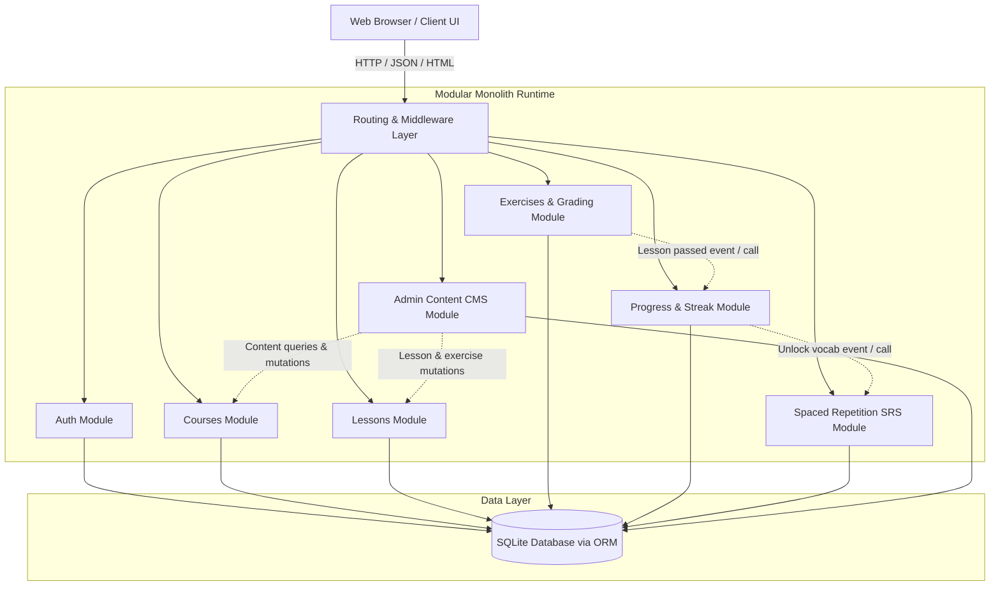
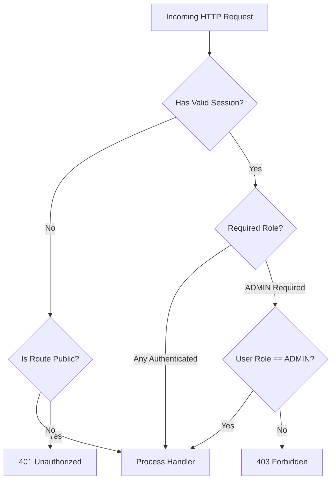

# Engineering Architecture: Modular Monolith

## 1. Architectural Paradigm

The system is designed as a **Modular Monolith**. 

A modular monolith delivers the advantages of strict domain encapsulation, clear business boundaries, and clean separation of concerns, while avoiding the distributed complexity, latency overhead, network failures, and deployment friction of microservices.



### Architectural Principles:
1. **Single Deployment Unit**: One server process runs the entire application, making local development, testing, and debugging fast and deterministic.
2. **Encapsulated Domain Modules**: Each module owns its business logic, validation rules, and domain services.
3. **Strict Layering**: Handlers/Controllers parse requests $\to$ call Domain Services $\to$ call Data Access/ORM repositories. Business logic does not leak into UI components or raw HTTP handlers.
4. **No Direct Cross-Module Data Tampering**: Modules communicate via explicit internal service interfaces. For instance, the `exercises` module does not write directly to `srs_cards`; instead, when a lesson is completed, it invokes the `progressService` and `srsService` via programmatic service calls.
5. **No External Message Broker Needed**: Event handling (such as enrolling in a course or completing a lesson) is executed synchronously in-process within local database transactions.

---

## 2. Modular Boundaries & Responsibilities

```
src/
├── modules/
│   ├── auth/          # User authentication, password hashing, session tokens, RBAC
│   ├── courses/       # Catalog, courses, modules, student enrollment
│   ├── lessons/       # Structured lesson content: Hangul, vocab, grammar, dialogue, audio URLs
│   ├── exercises/     # Quiz bank, exercise definitions, server-side grading engine
│   ├── progress/      # Lesson completion tracking, daily activity log, streak engine
│   ├── srs/           # Spaced Repetition System: SM-2 algorithm, review queue, flashcards
│   └── admin/         # Content CMS controllers, administrative data management
├── shared/
│   ├── db/            # Database client, migrations, base ORM setup
│   ├── errors/        # Domain error types and HTTP status mappings
│   ├── middleware/    # Auth session verification, RBAC guard, input validation
│   └── utils/         # Date arithmetic, string helpers, audio URL validators
```

### Module Breakdown

| Module | Core Responsibilities | Public Service Interface |
| :--- | :--- | :--- |
| **`auth`** | Registration, credential verification, password hashing (Argon2id/bcrypt), session generation, role assertion (`STUDENT`, `ADMIN`). | `authService.register()`, `authService.login()`, `authService.verifySession()`, `authService.getUserById()` |
| **`courses`** | Course metadata, syllabus structure, module grouping, student enrollment state. | `courseService.listPublishedCourses()`, `courseService.getCourseBySlug()`, `courseService.enrollStudent()` |
| **`lessons`** | Ordered lesson retrieval, lesson content blocks (Hangul, Vocab, Grammar, Dialogue, Audio URLs), sequential access enforcement. | `lessonService.getLessonDetails()`, `lessonService.getLessonsForModule()`, `lessonService.isLessonUnlocked()` |
| **`exercises`** | Exercise generation (sanitized client payload without answers), server-side answer evaluation, score calculation. | `exerciseService.getLessonExercisesSanitized()`, `exerciseService.gradeSubmission()` |
| **`progress`** | Recording lesson completion, score updates, daily study activity, calculating continuous study streaks. | `progressService.recordLessonCompletion()`, `progressService.getUserStreak()`, `progressService.getCourseProgress()` |
| **`srs`** | Spaced Repetition card lifecycle, SM-2 interval calculations, fetching due review queue, logging review feedback. | `srsService.enqueueLessonVocabulary()`, `srsService.getDueReviewQueue()`, `srsService.processCardReview()` |
| **`admin`** | Administrative content authoring, course/lesson/exercise/vocabulary CRUD, publishing state controls. | `adminService.createCourse()`, `adminService.updateLesson()`, `adminService.upsertExercise()` |

---

## 3. Route Map & API Surface

### 3.1 Web Pages / UI Route Map

| Route Path | Access Level | Description |
| :--- | :--- | :--- |
| `/` | Public (Visitor) | Marketing landing page introducing Hangul fundamentals, features, and course preview. |
| `/catalog` | Public (Visitor) | Full course catalog showcasing available Korean courses and syllabi. |
| `/courses/:slug` | Public (Visitor) | Course syllabus details, module listings, and "Enroll" CTA. |
| `/login` | Public (Guest only) | Email and password sign-in form. Redirects to `/dashboard` if already logged in. |
| `/register` | Public (Guest only) | New student registration form. Redirects to `/dashboard` upon creation. |
| `/dashboard` | Protected (Student) | Student home: current active course, progress summary, streak badge, due SRS reviews. |
| `/courses/:slug/learn` | Protected (Student) | Enrolled course view with module accordion, locked/unlocked lessons, completion checkmarks. |
| `/lessons/:id` | Protected (Student) | Lesson study interface: Hangul guide, vocabulary, grammar notes, dialogue, audio player. |
| `/lessons/:id/quiz` | Protected (Student) | Interactive practice quiz for the lesson: multiple choice, fill-in-blank, matching, ordering. |
| `/reviews` | Protected (Student) | SRS flashcard review session for vocabulary items due today. |
| `/profile` | Protected (Student) | Student profile, streak calendar, completion statistics, account details. |
| `/admin` | Protected (Admin) | Content management overview: counts of courses, lessons, users, active enrollments. |
| `/admin/courses` | Protected (Admin) | Course listing with create/edit/publish options. |
| `/admin/courses/:id/modules` | Protected (Admin) | Curriculum editor: manage modules and ordered lessons. |
| `/admin/lessons/:id/edit` | Protected (Admin) | Lesson editor: edit text, Hangul explanations, vocabulary, grammar, dialogues, and audio URLs. |
| `/admin/lessons/:id/exercises`| Protected (Admin) | Exercise question bank manager: add/edit questions, options, and server grading keys. |

---

### 3.2 REST API Specification

All API endpoints return a standardized JSON response envelope:
```typescript
type ApiResponse<T> = 
  | { success: true; data: T }
  | { success: false; error: { code: string; message: string; details?: unknown } };
```

#### Authentication API
- `POST /api/auth/register` — Body: `{ email, password, name }`. Returns user & session token/cookie.
- `POST /api/auth/login` — Body: `{ email, password }`. Returns user & session token/cookie.
- `POST /api/auth/logout` — Invalidates session / clears authentication cookie.
- `GET /api/auth/me` — Returns currently authenticated user profile and role.

#### Courses & Enrollment API
- `GET /api/courses` — Returns all published courses with module counts.
- `GET /api/courses/:slug` — Returns course detail, full syllabus, and current user enrollment status.
- `POST /api/courses/:id/enroll` — Enrolls the authenticated student in the course.

#### Lessons & Content API
- `GET /api/lessons/:id` — Returns lesson content (Hangul, vocab, grammar, dialogue with audio URLs). Verifies user is enrolled and lesson is unlocked.

#### Exercises & Grading API
- `GET /api/lessons/:id/exercises` — Returns quiz questions for the lesson. **Critical**: Server strips all answer keys and grading solutions before returning.
- `POST /api/lessons/:id/exercises/submit` — Body: `{ answers: [{ exerciseId, studentAnswer }] }`. Server evaluates answers, calculates percentage score, updates lesson completion, updates study streak, seeds vocabulary to SRS queue, and returns detailed question feedback.

#### Progress & Streak API
- `GET /api/progress/summary` — Returns user's active courses, overall completion percentage, and streak status.
- `GET /api/progress/streak` — Returns `{ currentStreak, longestStreak, lastActivityDate, weeklyActivity: boolean[] }`.

#### Spaced Repetition (SRS) API
- `GET /api/srs/queue` — Returns list of vocabulary flashcards due for review today (`dueAt <= NOW()`).
- `POST /api/srs/review` — Body: `{ cardId, rating: 1 | 2 | 3 | 4 }`. Applies SM-2 algorithm, updates interval/ease factor, and returns updated card schedule.

#### Admin CMS API (Restricted to `ADMIN` role)
- `POST /api/admin/courses` — Create new course.
- `PUT /api/admin/courses/:id` — Update course metadata or publish state.
- `POST /api/admin/courses/:id/modules` — Create module in course.
- `POST /api/admin/modules/:id/lessons` — Create lesson in module.
- `PUT /api/admin/lessons/:id` — Update lesson content (text, Hangul, grammar, dialogue, audio URLs).
- `POST /api/admin/lessons/:id/vocab` — Upsert vocabulary items for lesson.
- `POST /api/admin/lessons/:id/exercises` — Upsert exercises and server grading keys.

---

## 4. Role-Based Access Control (RBAC) & Security Architecture



### Security Directives:
1. **Password Hashing**: Passwords must be hashed using Argon2id or bcrypt (salt rounds $\ge 12$). Plaintext passwords must never be logged or persisted.
2. **Session Security**: Sessions are issued via an encrypted or signed token stored in an `HTTP-only`, `SameSite=Lax`, secure cookie to mitigate XSS and CSRF token theft.
3. **Zero Client-Side Grading**:
   - The client application must **never** receive the answer key, regex patterns, or validation logic for exercises via the `GET /api/lessons/:id/exercises` endpoint.
   - Grading takes place strictly inside `exerciseService.gradeSubmission()` on the server.
4. **URL & Input Sanitization**:
   - Audio URLs must be validated against well-formed HTTPS URL formats.
   - All inbound JSON payloads must be validated using Zod schemas; malformed requests are rejected immediately with HTTP 400.
5. **No File Upload Vulnerabilities**:
   - File uploads are explicitly excluded from the MVP. Content managers provide hosted audio URLs (e.g. Wikimedia Commons, approved CDNs) or pre-bundled local static assets.

---

## 5. Technology Stack Architecture

- **Runtime & Language**: Node.js (v18+) with TypeScript (strict mode enabled).
- **Web Layer**: Next.js (App Router or Pages Router) providing server-side API handlers and a modern, accessible React-based user interface.
- **Data Persistence**: Relational SQLite database operated locally via an ORM (Prisma or Drizzle ORM). SQLite provides ACID transactions with zero configuration and zero external service overhead for local development.
- **Styling**: Vanilla CSS / modern CSS Modules with custom design tokens (color palettes, Hangul typography variables, cards, glassmorphism badges, and smooth transitions).
- **Validation**: Zod for request body validation and runtime schema assertion.
