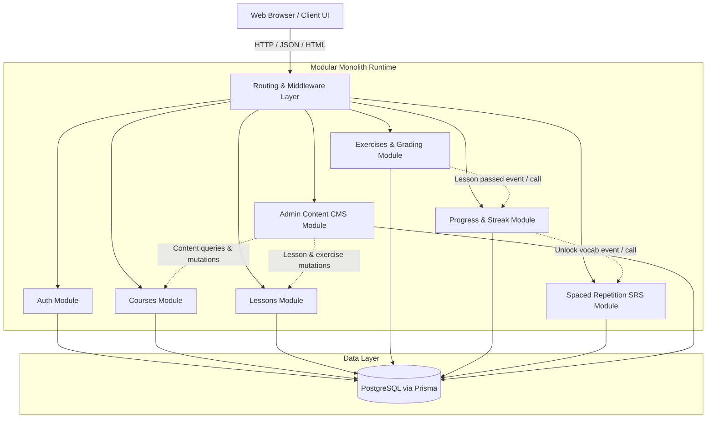
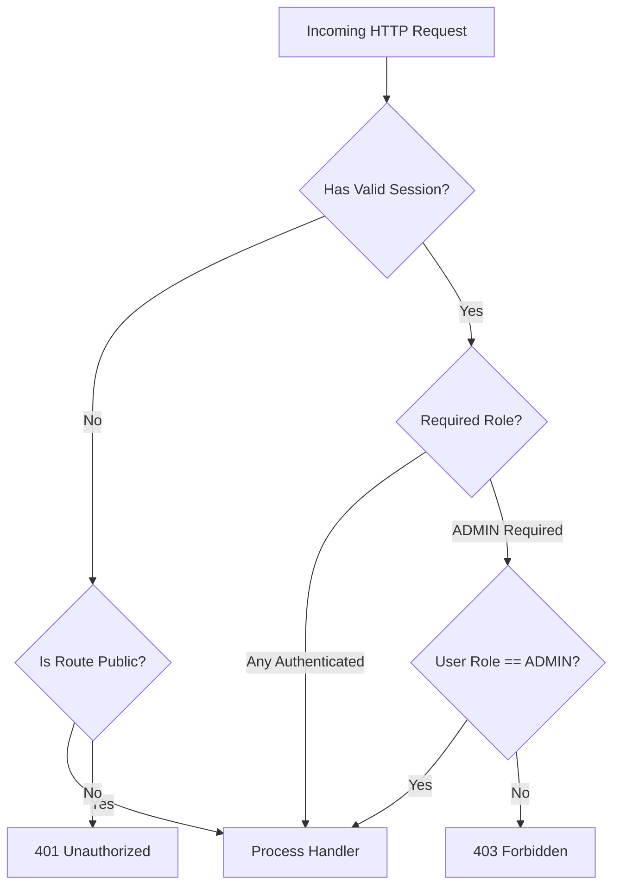

# Engineering Architecture: Modular Monolith

## 1. Architectural Paradigm

The system is designed as a **Modular Monolith**. 

A modular monolith delivers the advantages of strict domain encapsulation, clear business boundaries, and clean separation of concerns, while avoiding the distributed complexity, latency overhead, network failures, and deployment friction of microservices.



### Architectural Principles:
1. **Single Deployment Unit**: One server process runs the entire application, making local development, testing, and debugging fast and deterministic.
2. **Encapsulated Domain Modules**: Each module owns its business logic, validation rules, and domain services.
3. **Strict Layering**: Handlers/Controllers parse requests $\to$ call Domain Services $\to$ call Data Access/ORM repositories. Business logic does not leak into UI components or raw HTTP handlers.
4. **No Direct Cross-Module Data Tampering**: Modules communicate via explicit internal service interfaces. For instance, the `exercises` module does not write directly to `ReviewCard`; instead, when a lesson is completed, it invokes the `progressService` and `srsService` via programmatic service calls.
5. **No External Message Broker Needed**: Event handling (such as enrolling in a course or completing a lesson) is executed synchronously in-process within local database transactions.

---

## 2. Modular Boundaries & Responsibilities

```
src/
├── modules/
│   ├── auth/          # User authentication, password hashing, session tokens, RBAC
│   ├── courses/       # Catalog, courses, chapters, student enrollment
│   ├── lessons/       # Structured lesson content: Hangul, vocab, grammar, dialogue, audio URLs
│   ├── exercises/     # Quiz bank, exercise definitions, server-side grading engine
│   ├── progress/      # Lesson completion tracking, daily activity log, streak engine
│   ├── srs/           # Spaced Repetition System: SM-2 algorithm, review queue, flashcards
│   └── admin/         # Content CMS controllers, administrative data management
├── shared/
│   ├── db/            # Database client, migrations, base ORM setup
│   ├── errors/        # Domain error types and HTTP status mappings
│   ├── middleware/    # Auth session verification, RBAC guard, input validation
│   └── utils/         # Date arithmetic, string helpers, audio URL validators
```

### Module Breakdown

| Module | Core Responsibilities | Public Service Interface |
| :--- | :--- | :--- |
| **`auth`** | Better Auth registration, salted scrypt credential hashing, sessions, and role assertion (`STUDENT`, `ADMIN`). | Better Auth server/client adapters and server session guards. |
| **`courses`** | Course metadata, syllabus structure, chapter grouping, student enrollment state. | `courseService.getPublishedCatalog()`, `courseService.getCourseBySlug()`, `courseService.enrollStudent()` |
| **`lessons`** | Ordered lesson retrieval, lesson content blocks and sequential access enforcement. | `lessonService.getPublishedLessonBySlug()`, `lessonService.getPublishedLessonWithNavigation()`, `lessonAccessService.requireAccess()` |
| **`exercises`** | Sanitized delivery, server grading and saved results. | `exerciseService.getExerciseForStudent()`, `exerciseService.submitAttempt()`, `exerciseService.getAttemptResultForStudent()` |
| **`progress`** | Lesson completion, scores, daily activity and streaks. | `progressService.completeLesson()`, `progressService.getUserStreak()`, `progressService.getCourseProgress()` |
| **`srs`** | Card lifecycle, scheduling, due queue and feedback. | `srsService.enqueueLessonVocabulary()`, `srsService.getDueCardsForStudent()`, `srsService.submitCardReview()` |
| **`admin`** | Content authoring, CRUD and publishing. | `adminService.createCourse()`, `adminService.updateLesson()`, `adminService.createExercise()`, `adminService.updateExercise()` |

---

## 3. Route Map & API Surface

### 3.1 Current pages

| Route | Access and purpose |
| --- | --- |
| `/`, `/courses`, `/catalog` | Public landing/catalog; /catalog redirects to /courses. |
| `/courses/[slug]` | Public published syllabus and enrollment action. |
| `/dang-nhap`, `/dang-ky` | Login and registration. |
| `/dashboard` | Authenticated student's progress, streak and due-card summary. |
| `/courses/[slug]/lessons/[lessonSlug]`, `/lessons/[slug]` | Protected readers with enrollment/publication/prerequisite checks; quizzes are embedded. |
| `/on-tap` | Authenticated SRS review queue. |
| `/admin`, `/admin/courses`, `/admin/courses/new`, `/admin/courses/[id]/edit` | ADMIN overview and curriculum management. |
| `/admin/chapters/[id]/lessons` | ADMIN lesson ordering and metadata. |
| `/admin/lessons/[id]/edit`, `/admin/lessons/[id]/preview` | ADMIN blocks, vocabulary, exercise questions and draft preview. |

### 3.2 Current HTTP APIs

- Better Auth handles /api/auth/[...all]: sign-up/email, sign-in/email, sign-out, and get-session.
- POST /api/courses/[id]/enroll creates the authenticated user's enrollment.
- GET /api/exercises/[id] returns sanitized questions; POST /api/exercises/[id]/submit validates, grades and returns the same saved DTO for submission and replay.
- POST /api/lessons/[id]/progress supports START and COMPLETE, enforcing enrollment and prerequisites. Completion requires a passing published exercise when one exists.
- GET /api/srs/due, GET /api/srs/stats, and POST /api/srs/review serve only the session user's cards/activity.
- ADMIN CRUD/reorder routes under /api/admin cover courses, chapters, lessons, blocks, vocabularies, exercises and questions. Child creation/list routes are nested under their parent; item updates/deletes use item IDs. All enforce the ADMIN guard.
- Public GET /api/health checks connectivity. Failures return 503 with a fixed message; original diagnostics are logged server-side.

Domain APIs use { success: true, data } or { success: false, error: { code, message, details? } }. Better Auth and health have their own response contracts. Catalog/lesson server pages load through services rather than public catalog/lesson GET APIs.

---

## 4. Role-Based Access Control (RBAC) & Security Architecture



### Security Directives:
1. **Password Hashing**: Better Auth uses salted scrypt for credential passwords. Plaintext passwords must never be logged or persisted.
2. **Session Security**: Sessions are issued via an encrypted or signed token stored in an `HTTP-only`, `SameSite=Lax`, secure cookie to mitigate XSS and CSRF token theft.
3. **Zero Client-Side Grading**:
   - The client application must **never** receive the answer key, regex patterns, or validation logic for exercises via the `GET /api/lessons/:id/exercises` endpoint.
   - Grading takes place strictly inside `exerciseService.gradeSubmission()` on the server.
4. **URL & Input Sanitization**:
   - Audio URLs must be validated as configured HTTP(S) URLs or local paths before authoring.
   - All inbound JSON payloads must be validated using Zod schemas; malformed requests are rejected immediately with HTTP 400.
5. **No File Upload Vulnerabilities**:
   - File uploads are explicitly excluded from the MVP. Content managers provide hosted audio URLs (e.g. Wikimedia Commons, approved CDNs) or pre-bundled local static assets.

---

## 5. Technology Stack Architecture

- **Runtime & Language**: Node.js 20.19+ with TypeScript (strict mode enabled).
- **Web Layer**: Next.js App Router providing server-side route handlers and React pages.
- **Data Persistence**: PostgreSQL operated locally via Docker Compose or an existing server, accessed through Prisma. Database changes use Prisma migrations.
- **Styling**: Tailwind CSS with shared color and typography conventions.
- **Validation**: Zod for request body validation and runtime schema assertion.
