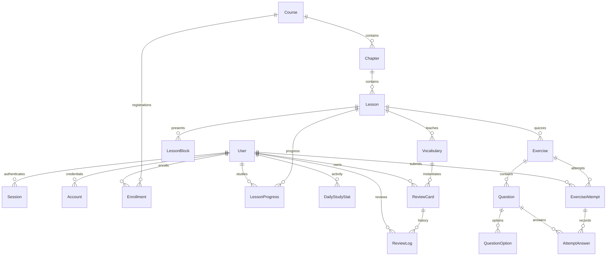

# Data Model & Learning Rules

The authoritative database definition is [prisma/schema.prisma](../prisma/schema.prisma), with six migrations under `prisma/migrations`. PostgreSQL 17 runs through Docker Compose or an existing local PostgreSQL server. Prisma 7 reads its connection configuration from `prisma.config.ts`; application queries use the PostgreSQL adapter.

## Entity relationships

## Actual Prisma models

| Model | Stored data and constraints |
| --- | --- |
| `User` | Unique email, display name, role string defaulting to `STUDENT`. Server guards authorize `ADMIN`; public registration cannot assign that role. Maps to table `user`. |
| `Session` | Unique token, expiry, user relation; maps to `session`. |
| `Account` | Better Auth credentials including a salted scrypt password hash; maps to `account`. Passwords never enter student payloads. |
| `Verification` | Better Auth identifier/value/expiry records; maps to `verification`. Email delivery is outside MVP scope. |
| `Course` | Unique slug, title, description, level, `ContentStatus`, `displayOrder`. |
| `Chapter` | Course relation, title, description, status/order; unique `(courseId, slug)`. |
| `Lesson` | Chapter relation, globally unique slug, summary, estimated minutes, status/order. |
| `LessonBlock` | Lesson relation, `BlockType`, order, structured JSON `content`. Type-specific validation runs before persistence and rendering. |
| `Vocabulary` | Lesson relation, Hangul, romanization, Vietnamese/English meanings, audio, examples and order. |
| `Exercise` | Lesson relation, title, description, status/order. Question types belong to its questions. |
| `Question` | Exercise relation, `QuestionType`, prompt, audio, protected answer/explanation, order. |
| `QuestionOption` | Question relation, text, protected correctness/explanation, order. Arrangement tiles are individual option records; repeated words have distinct IDs. |
| `Enrollment` | Unique `(userId, courseId)`, enrollment time and optional completion time. |
| `LessonProgress` | Unique `(userId, lessonId)`, status, highest score, start/completion times. |
| `DailyStudyStat` | Unique `(userId, date)`, lesson/review totals and minutes. Date is `YYYY-MM-DD` in `Asia/Ho_Chi_Minh`. |
| `ExerciseAttempt` | User/exercise, unique optional idempotency key, timestamps, score/max score/percentage, pass flag. |
| `AttemptAnswer` | Unique `(attemptId, questionId)`, selected option or text, saved correctness and score. Ordered arrangement IDs are stored in `textAnswer` as a comma-separated list. |
| `ReviewCard` | Unique `(userId, vocabularyId)`, state, interval/ease/repetition/lapse counters, due/review times. Indexed by `(userId, dueAt)`. |
| `ReviewLog` | User/card, rating, before/after schedule values, unique optional idempotency key and review time. |
| `SystemHealth` | Status/check time model. `/api/health` checks connectivity directly and does not require this table's records. |

Enums: `ContentStatus` = `DRAFT`, `PUBLISHED`, `ARCHIVED`; `BlockType` = `TEXT`, `HANGUL`, `VOCABULARY`, `GRAMMAR`, `DIALOGUE`, `AUDIO`, `CALLOUT`; `QuestionType` = the four types in Product FR-5.2; `LessonProgressStatus` = `NOT_STARTED`, `IN_PROGRESS`, `COMPLETED`; `CardState` = `NEW`, `LEARNING`, `REVIEW`, `MASTERED`; `ReviewRating` = `AGAIN`, `HARD`, `GOOD`, `EASY`.

Foreign-key relations use cascade deletion. Admin services block deletion of content with recorded student activity; question/exercise changes are restricted once attempts exist. Direct SQL bypasses those application guards. Schema indexes support parent/order lookups, ownership, activity dates and due-card queries.

## Access, completion and results

- Visitors may inspect published course syllabi. Reading a lesson requires authentication, enrollment, published course/chapter/lesson and completion of the preceding published lesson.
- Student exercise payloads omit answer keys, correctness flags and explanations before submission.
- Multiple-choice/listening questions require four options and one correct option. Arrangement questions require a usable tile bank capable of constructing the normalized answer, including repeated-word counts.
- Server grading uses 10 points per question and a passing percentage of at least 80%. Korean answers use NFC normalization, trimming, whitespace normalization and zero-width-character removal.
- For a lesson with published exercises, completion requires a passing attempt from one of those exercises. Exercise-free lessons must be started before completion. Repeated completion preserves the highest score without duplicating daily completion totals.
- Completion, daily activity and vocabulary-card enqueueing share a database transaction. Attempt recording occurs before completion; an idempotent replay can recover a completion failure.
- Initial submission and replay return the same `ExerciseResultDto`: attempt/exercise IDs, scores, percentage, pass flag, ISO submission timestamp and ordered `gradedQuestions` with saved scores and feedback.
- **Words learned** is the number of distinct vocabulary cards actually created for the student. The unique user/vocabulary constraint prevents repeated enqueue requests from increasing this count. Vocabulary-free lessons contribute zero.

## SRS scheduling

The four-rating SM-2-inspired implementation is in `src/modules/srs/srs-scheduler.ts`:

- Quality values are 1–4 for Again/Hard/Good/Easy.
- `EF' = max(1.30, EF + 0.1 - (4-q) * (0.08 + (4-q) * 0.02))`.
- Again resets repetitions, increments lapses, schedules one day, and enters `LEARNING`.
- Successful recall increments repetitions. The first two intervals are one and three days; later intervals use `round(interval * 1.2)` for Hard, `round(interval * EF')` for Good, and `round(interval * EF' * 1.3)` for Easy, with a minimum of one day.
- Intervals of at least 21 days enter `MASTERED`; other successful reviews enter `REVIEW`.
- Due time is the review instant plus the interval in milliseconds. `/on-tap` loads up to 50 due cards ordered by due time; the summary separately counts all due cards.
- One rating retains its idempotency key until acknowledgment. Retrying an uncertain response reuses the saved review; ownership is checked before replay.

## Study dates and timestamp convention

Daily study dates and streaks use `Asia/Ho_Chi_Minh`, independently of browser/server timezone. Streaks are derived from `DailyStudyStat` rows with lesson or review activity; they are not stored in a separate streak entity. Today/yesterday maintain consecutive streaks, older activity breaks the current streak, and the longest consecutive run is computed from history.

Application timestamps use JavaScript `Date` instants and ISO UTC responses. Prisma's PostgreSQL `DateTime` columns are timestamp-without-timezone columns. Keep raw SQL writers/defaults consistent with the application's UTC convention; the column type itself does not enforce UTC.
