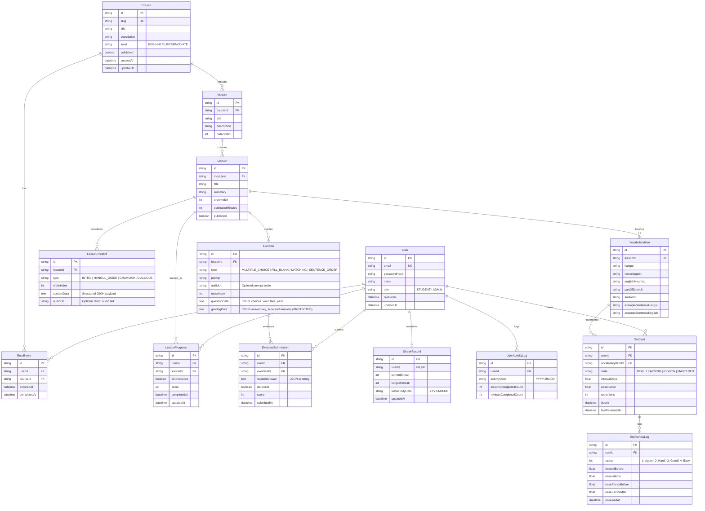

# Data Model & Schema Specification

## 1. Entity Relationship Diagram (ERD)



---

## 2. Relational Schema & Entity Definitions

### 2.1 Identity & Access Entities

#### `User`
Stores credential records and platform roles.
- `id` (String, UUID or CUID, Primary Key)
- `email` (String, Unique, Indexed, Lowercase trimmed)
- `passwordHash` (String, Argon2id or bcrypt hash)
- `name` (String, Display name)
- `role` (Enum: `STUDENT`, `ADMIN`, Default: `STUDENT`)
- `createdAt` (DateTime, Default: now)
- `updatedAt` (DateTime, Auto-updated)

### 2.2 Curriculum & Content Entities

#### `Course`
Top-level syllabus grouping.
- `id` (String, Primary Key)
- `slug` (String, Unique, URL-friendly slug, e.g., `beginner-korean-1`)
- `title` (String, e.g., "Beginner Korean 1: Hangul & Essentials")
- `description` (Text, Comprehensive course overview)
- `level` (Enum: `BEGINNER`, `INTERMEDIATE`, Default: `BEGINNER`)
- `published` (Boolean, Default: false)
- `createdAt` (DateTime)
- `updatedAt` (DateTime)

#### `Enrollment`
Student registration in a course.
- `id` (String, Primary Key)
- `userId` (String, Foreign Key $\to$ `User.id`, Cascade Delete)
- `courseId` (String, Foreign Key $\to$ `Course.id`, Cascade Delete)
- `enrolledAt` (DateTime, Default: now)
- `completedAt` (DateTime, Nullable)
- **Constraint**: `UNIQUE(userId, courseId)`

#### `Module`
Curriculum chapter grouping sequential lessons.
- `id` (String, Primary Key)
- `courseId` (String, Foreign Key $\to$ `Course.id`, Cascade Delete)
- `title` (String, e.g., "Module 1: Hangul Vowels & Basic Consonants")
- `description` (Text, Short overview)
- `orderIndex` (Integer, Positive index for sequencing)

#### `Lesson`
Single study unit within a module.
- `id` (String, Primary Key)
- `moduleId` (String, Foreign Key $\to$ `Module.id`, Cascade Delete)
- `title` (String, e.g., "Lesson 1: Basic Vowels (ㅏ, ㅓ, ㅗ, ㅜ, ㅡ, ㅣ)")
- `summary` (Text, Short summary)
- `orderIndex` (Integer, Sequence order within the module)
- `estimatedMinutes` (Integer, e.g., 15)
- `published` (Boolean, Default: true)

#### `LessonContent`
Modular structured content blocks belonging to a lesson.
- `id` (String, Primary Key)
- `lessonId` (String, Foreign Key $\to$ `Lesson.id`, Cascade Delete)
- `type` (Enum: `INTRO`, `HANGUL_GUIDE`, `GRAMMAR`, `DIALOGUE`)
- `orderIndex` (Integer, Visual order)
- `contentData` (Text / JSON):
  - For `HANGUL_GUIDE`: `{ characters: [{ char: "ㅏ", romanization: "a", strokeCount: 2, soundHint: "like 'a' in father" }] }`
  - For `GRAMMAR`: `{ title: "Topic Particle 은/는", formula: "Noun + 은/는", explanation: "...", examples: [{ kr: "저는 학생이에요", en: "As for me, I am a student" }] }`
  - For `DIALOGUE`: `{ lines: [{ speaker: "Minho", korean: "안녕하세요!", english: "Hello!", audioUrl: "https://..." }] }`
- `audioUrl` (String, Nullable, direct HTTPS audio URL)

#### `VocabularyItem`
Core vocabulary taught in the lesson, ready to enter the SRS queue.
- `id` (String, Primary Key)
- `lessonId` (String, Foreign Key $\to$ `Lesson.id`, Cascade Delete)
- `hangul` (String, e.g., "사과")
- `romanization` (String, e.g., "sagwa")
- `englishMeaning` (String, e.g., "Apple")
- `partOfSpeech` (String, e.g., "Noun")
- `audioUrl` (String, Direct HTTPS link to native speaker audio)
- `exampleSentenceHangul` (Text, e.g., "사과가 맛있어요.")
- `exampleSentenceEnglish` (Text, e.g., "The apple is delicious.")

### 2.3 Interactive Exercise & Grading Entities

#### `Exercise`
Quiz questions associated with a lesson.
- `id` (String, Primary Key)
- `lessonId` (String, Foreign Key $\to$ `Lesson.id`, Cascade Delete)
- `type` (Enum: `MULTIPLE_CHOICE`, `FILL_BLANK`, `MATCHING`, `SENTENCE_ORDER`)
- `prompt` (Text, e.g., "Select the correct translation for '안녕하세요'")
- `audioUrl` (String, Nullable, Audio file URL for listening questions)
- `orderIndex` (Integer)
- `questionData` (Text / JSON): Client-safe options (e.g., choice options `["Hello", "Goodbye", "Thank you", "Sorry"]`, or scrambled word tiles `["저는", "학생", "이에요"]`).
- `gradingData` (Text / JSON): **Protected server-side data**. Contains correct choice ID, acceptable text regexes, or target word order. **Never returned in public/student API responses.**

#### `ExerciseSubmission`
Audit log of student submissions and scores.
- `id` (String, Primary Key)
- `userId` (String, Foreign Key $\to$ `User.id`, Cascade Delete)
- `exerciseId` (String, Foreign Key $\to$ `Exercise.id`, Cascade Delete)
- `studentAnswer` (Text, Student's provided input)
- `isCorrect` (Boolean)
- `score` (Integer, 0 to 100)
- `submittedAt` (DateTime, Default: now)

### 2.4 Progress & Streak Entities

#### `LessonProgress`
Tracks lesson status and highest score for a student.
- `id` (String, Primary Key)
- `userId` (String, Foreign Key $\to$ `User.id`, Cascade Delete)
- `lessonId` (String, Foreign Key $\to$ `Lesson.id`, Cascade Delete)
- `isCompleted` (Boolean, Default: false)
- `score` (Integer, Best recorded score, 0 to 100)
- `completedAt` (DateTime, Nullable)
- `updatedAt` (DateTime)
- **Constraint**: `UNIQUE(userId, lessonId)`

#### `StreakRecord`
Maintains current and longest consecutive study streaks.
- `id` (String, Primary Key)
- `userId` (String, Foreign Key $\to$ `User.id`, Cascade Delete)
- `currentStreak` (Integer, Default: 0)
- `longestStreak` (Integer, Default: 0)
- `lastActivityDate` (String, Format: `YYYY-MM-DD`, Nullable)
- `updatedAt` (DateTime)
- **Constraint**: `UNIQUE(userId)`

#### `UserActivityLog`
Granular daily activity record used for streak visualization and auditing.
- `id` (String, Primary Key)
- `userId` (String, Foreign Key $\to$ `User.id`, Cascade Delete)
- `activityDate` (String, Format: `YYYY-MM-DD`, Indexed)
- `lessonsCompletedCount` (Integer, Default: 0)
- `reviewsCompletedCount` (Integer, Default: 0)
- **Constraint**: `UNIQUE(userId, activityDate)`

### 2.5 Spaced Repetition (SRS) Entities

#### `SrsCard`
Individual vocabulary flashcard tracked in the spaced repetition engine.
- `id` (String, Primary Key)
- `userId` (String, Foreign Key $\to$ `User.id`, Cascade Delete)
- `vocabularyItemId` (String, Foreign Key $\to$ `VocabularyItem.id`, Cascade Delete)
- `state` (Enum: `NEW`, `LEARNING`, `REVIEW`, `MASTERED`, Default: `NEW`)
- `intervalDays` (Float, Default: 0)
- `easeFactor` (Float, Default: 2.50)
- `repetitions` (Integer, Default: 0)
- `dueAt` (DateTime, Default: now, Indexed)
- `lastReviewedAt` (DateTime, Nullable)
- **Constraint**: `UNIQUE(userId, vocabularyItemId)`

#### `SrsReviewLog`
History log of each flashcard review event.
- `id` (String, Primary Key)
- `cardId` (String, Foreign Key $\to$ `SrsCard.id`, Cascade Delete)
- `rating` (Integer, 1 = Again, 2 = Hard, 3 = Good, 4 = Easy)
- `intervalBefore` (Float)
- `intervalAfter` (Float)
- `easeFactorBefore` (Float)
- `easeFactorAfter` (Float)
- `reviewedAt` (DateTime, Default: now)

---

## 3. Algorithmic Specifications

### 3.1 SuperMemo-2 (SM-2) Spaced Repetition Engine

When a student reviews an SRS card with rating $q \in \{1, 2, 3, 4\}$:

1. **Mapping Rating to Quality ($q$)**:
   - `1`: Again (Complete lapse / failure)
   - `2`: Hard (Correct after substantial effort)
   - `3`: Good (Standard successful recall)
   - `4`: Easy (Effortless immediate recall)

2. **Ease Factor ($EF$) Calculation**:
   $$EF' = EF + (0.1 - (4 - q) \times (0.08 + (4 - q) \times 0.02))$$
   *Constraint*: If $EF' < 1.30$, clamp $EF' = 1.30$.

3. **Repetitions & Interval Calculation**:
   - **If $q = 1$ (Failed review)**:
     - $Repetitions' = 0$
     - $Interval' = 1 \text{ day}$
     - $State' = \text{LEARNING}$
   - **If $q \ge 2$ (Successful review)**:
     - If $Repetitions = 0$: $Interval' = 1 \text{ day}$
     - If $Repetitions = 1$: $Interval' = 3 \text{ days}$ (optimized for introductory language retention)
     - If $Repetitions \ge 2$:
       - If $q = 2$ (Hard): $Interval' = \text{round}(Interval \times 1.2)$
       - If $q = 3$ (Good): $Interval' = \text{round}(Interval \times EF')$
       - If $q = 4$ (Easy): $Interval' = \text{round}(Interval \times EF' \times 1.3)$
     - $Repetitions' = Repetitions + 1$
     - If $Interval' \ge 21 \text{ days}$: $State' = \text{MASTERED}$, else $State' = \text{REVIEW}$

4. **Next Due Date**:
   $$DueAt = NOW() + (Interval' \times 86400 \text{ seconds})$$

5. **Queue Retrieval Query**:
   ```sql
   SELECT c.*, v.hangul, v.romanization, v.englishMeaning, v.partOfSpeech, v.audioUrl, v.exampleSentenceHangul, v.exampleSentenceEnglish
   FROM SrsCard c
   JOIN VocabularyItem v ON c.vocabularyItemId = v.id
   WHERE c.userId = :userId AND c.dueAt <= :currentTimestamp
   ORDER BY c.dueAt ASC
   LIMIT 50;
   ```

---

### 3.2 Daily Study Streak Engine

Activity is recorded whenever a student passes a lesson quiz or completes an SRS review session.

1. Let $Today$ be the current calendar date string in `YYYY-MM-DD` (UTC or user local timezone).
2. Let $Yesterday$ be the previous calendar day string in `YYYY-MM-DD`.
3. Fetch the user's `StreakRecord`:
   - **Case 1: No previous record**:
     - `currentStreak = 1`
     - `longestStreak = 1`
     - `lastActivityDate = Today`
   - **Case 2: `lastActivityDate == Today`**:
     - The user has already maintained their streak today.
     - Keep `currentStreak` unchanged.
   - **Case 3: `lastActivityDate == Yesterday`**:
     - The user studied consecutive days.
     - `currentStreak = currentStreak + 1`
     - `longestStreak = max(longestStreak, currentStreak)`
     - `lastActivityDate = Today`
   - **Case 4: `lastActivityDate < Yesterday`**:
     - The user missed at least one calendar day.
     - `currentStreak = 1`
     - `lastActivityDate = Today`
4. Upsert `UserActivityLog`:
   - Increment `lessonsCompletedCount` or `reviewsCompletedCount` for $(userId, Today)$.
