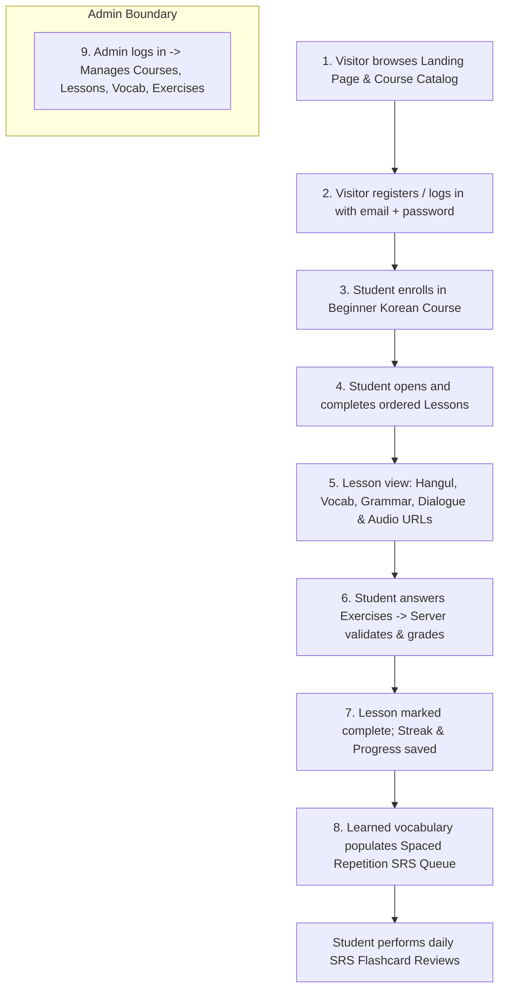

# Product Specification: Korean Language Learning Platform (MVP)

## 1. Executive Summary

This product specification defines the Minimum Viable Product (MVP) for a web-based Korean language learning platform. The application offers an engaging, structured curriculum starting from the absolute basics of the Korean writing system (Hangul), progressing through essential vocabulary and grammar, reinforcing concepts through server-evaluated interactive exercises, tracking continuous daily study streaks, and retaining learned vocabulary through an automated Spaced Repetition System (SRS).

The platform is engineered as a clean, highly cohesive **modular monolith** optimized for friction-free local execution and straightforward maintenance.

---

## 2. Target Personas & User Roles

| Role | Persona | Needs & Goals |
| :--- | :--- | :--- |
| **VISITOR** | Unauthenticated curious learner | Browse the course catalog, inspect course curriculum previews, understand platform features, and create an account. |
| **STUDENT** | "Alex" — Beginner Korean learner | Enroll in the beginner course, study ordered lessons containing Hangul breakdowns, vocabulary, grammar rules, dialogues with audio, practice exercises with immediate feedback, maintain a daily streak, and review due vocabulary flashcards. |
| **ADMIN** | "Master Instructor / Admin" | Maintain curriculum integrity: create and publish courses, organize modules and lessons, configure exercise question banks and answer keys, and manage vocabulary items with audio links. |

---

## 3. End-to-End MVP User Journey

The MVP encompasses the complete end-to-end user lifecycle across nine distinct stages:

### Detailed Journey Steps:
1. **Catalog & Landing Discovery**: The visitor lands on a polished marketing homepage highlighting features (Hangul foundation, interactive exercises, SRS) and views the course catalog containing the flagship *"Beginner Korean 1 (Hangul & Essentials)"* course.
2. **Account Creation & Authentication**: The visitor registers with an email, display name, and password. No email verification link is required for the MVP; registration automatically logs the user in. Existing users sign in via credentials.
3. **Course Enrollment**: From the catalog or course detail page, the student clicks "Enroll Now". The system creates an active enrollment record and redirects the student to the course learning dashboard.
4. **Ordered Lesson Progression**: The course is split into structured modules containing sequential lessons. Lessons follow an ordered path (Lesson 1 unlocks Lesson 2 upon completion).
5. **Rich Lesson Content Delivery**: A lesson presents multi-faceted content components:
   - **Text & Hangul Breakdown**: Visual stroke guides, syllable block breakdowns (Initial consonant + Vowel + Batchim), Romanization, and pronunciation tips.
   - **Vocabulary Bank**: Key terms with Korean Hangul, English definition, part of speech, and example sentences.
   - **Grammar Explanations**: Concise grammatical formulas (e.g., `-이에요/예요`, subject particles `-이/가`, topic particles `-은/는`) with contextual usage rules.
   - **Interactive Dialogue**: Conversational scenarios between two speakers with Hangul scripts, English translations, and individual line audio triggers.
   - **Audio Player**: Web-native HTML5 playback of verified repository-local audio assets under `public/audio` or validated configured audio URLs.
6. **Interactive Exercises with Server-Side Grading**: At the end of a lesson, the student undertakes a practice quiz featuring:
   - Multiple Choice Questions (Hangul to English, English to Hangul, audio prompt identification).
   - Fill-in-the-blank (typing Hangul or selecting particle).
   - Sentence Reordering (assembling word blocks into grammatical Korean sentences).
   - Word Matching (pairing Hangul terms with English definitions).
   - **Server-Side Grading**: Client sends answers to the server. The server calculates results against protected answer keys, returns score percentage, correct/incorrect statuses, and explanations. Answer keys are never exposed in advance to the client.
7. **Progress & Daily Study Streak**: Upon achieving a passing threshold (e.g., 80% or completing all required questions), the lesson is marked completed. The progress engine logs daily activity and increments the student's daily study streak (calculating active day boundaries).
8. **Spaced Repetition System (SRS) Review Queue**: All vocabulary items tied to completed lessons are automatically seeded into the student's personal SRS deck using an SM-2 algorithmic model. When reviews become due (based on calculated intervals: 1 day, 3 days, 7 days, etc.), the student reviews flashcards via the `/reviews` view, grading their recall quality.
9. **Admin Content Management**: An administrator accessing `/admin` can manage courses, modules, lessons, content sections, vocabulary items, audio URLs, and exercise question banks with immediate persistence.

---

## 4. MVP Scope & Boundaries

To ensure focus, quality, and robust implementation, boundaries are strictly enforced:

### In-Scope (MVP Features)
- Responsive web application for desktop and mobile browsers.
- Local email + password authentication with role-based authorization (`STUDENT`, `ADMIN`).
- Course catalog, course overview, syllabus viewer, and 1-click enrollment.
- Sequential lesson delivery with Hangul text, vocabulary, grammar notes, dialogues, and web audio playback from URLs.
- Server-side graded exercise engine supporting multiple question archetypes.
- Student progress dashboard with completion percentages and streak tracking.
- Spaced Repetition System (SM-2 implementation) with a daily review queue and flashcard session.
- Dedicated Admin dashboard for curriculum and exercise authoring.
- Comprehensive seed data providing an authentic beginner Korean learning experience out-of-the-box.

### Explicitly Excluded from MVP

| Excluded Feature | MVP Alternative / Rationale |
| :--- | :--- |
| **Payment Processing** (Stripe, etc.) | All courses in MVP are free to enroll. Focus is entirely on pedagogy and learning mechanics. |
| **Social Login** (Google, Kakao, etc.) | Standard email + password authentication simplifies local dev and avoids external OAuth app configuration. |
| **Email Delivery** (SMTP, SendGrid) | No email confirmation or password reset emails. Local testing accounts are created directly. |
| **AI Chat / AI Tutor** | Pre-authored structured curriculum with verified explanations delivers higher pedagogical accuracy. |
| **Pronunciation / Speech Scoring** | Students listen to high-quality audio URLs; no microphone input or speech-to-text processing. |
| **File Uploads** | Audio files and images are provided via external URLs or pre-seeded public assets. Avoids multipart storage complexity. |
| **Community Forum / Comments** | Interaction is focused on the solo learner loop (learn -> quiz -> review). |
| **Native Mobile App** | Fully responsive web UI built for mobile and desktop viewports. |
| **Redis & Background Queues** | SRS schedules and streak updates are computed synchronously in PostgreSQL transactions. |
| **Cloud Deployment** | Operates as a local-first development stack requiring zero cloud subscriptions or complex infrastructure. |

---

## 5. Functional Requirements Specification

### FR-1: Course Catalog & Discovery
- **FR-1.1**: The system shall display published courses on the landing page and catalog route.
- **FR-1.2**: Each course card shall show title, summary, difficulty level (`BEGINNER`), total modules/lessons count, and estimated completion time.
- **FR-1.3**: Visitors can inspect the course syllabus (module and lesson titles) without enrolling.

### FR-2: Authentication & User Accounts
- **FR-2.1**: Visitors can register an account by providing email, password (min 8 characters), and full name.
- **FR-2.2**: Better Auth shall hash passwords with its salted scrypt implementation; plaintext passwords are never stored.
- **FR-2.3**: Users can sign in using email and password to obtain an authenticated session (HTTP-only secure cookie or JWT).
- **FR-2.4**: Roles are strictly differentiated between `STUDENT` and `ADMIN`.

### FR-3: Enrollment & Course Navigation
- **FR-3.1**: Authenticated students can enroll in any published course with a single action.
- **FR-3.2**: A student cannot enroll in the same course more than once.
- **FR-3.3**: The course dashboard shall display the student's enrollment status, progress percentage, next up lesson, and full module syllabus.
- **FR-3.4**: Lessons must be accessed in sequential order. A lesson is unlocked if it is the first lesson of the course or if the preceding lesson is completed.

### FR-4: Lesson Presentation & Audio Playback
- **FR-4.1**: A lesson reader shall display rich structured content sections:
  1. Introduction / Overview.
  2. Hangul Syllable & Pronunciation Breakdown (featuring large Hangul typography and Romanization toggle).
  3. Vocabulary Table (Hangul, Hanja/notes, English definition, audio trigger button).
  4. Grammar Points (pattern formula, explanation, Korean/English example pairs).
  5. Dialogue Section (speaker avatars/names, Korean lines, English translation toggle, line-by-line audio buttons).
- **FR-4.2**: The audio player must support standard web audio playback using direct URLs with play/pause/replay controls and loading/error states.

### FR-5: Exercise Delivery & Server-Side Grading
- **FR-5.1**: Exercise prompts and choice options must be fetched without disclosing correct answers or grading logic.
- **FR-5.2**: The system must support four exercise archetypes:
  - `MULTIPLE_CHOICE`: 4 options (text or audio prompt) with 1 correct choice.
  - `FILL_BLANK`: Text input for Hangul word or particle.
  - `ARRANGE_SENTENCE`: Interactive word tiles that the user arranges into a valid Korean sentence.
  - `LISTENING_CHOICE`: Listen to audio and select the correct choice.
- **MVP scope correction**: `MATCHING` is post-MVP. It is excluded from the current Definition of Done and is not implemented in this batch.
- **FR-5.3**: Exercise submissions are evaluated exclusively on the server.
- **FR-5.4**: The grading endpoint shall return: overall score percentage, pass/fail status (passing threshold $\ge 80\%$), question-by-question correctness, and explanatory feedback.

### FR-6: Progress & Daily Study Streak Engine
- **FR-6.1**: Upon passing a lesson's exercise quiz, the lesson is marked as completed with the student's highest score.
- **FR-6.2**: The streak engine calculates the user's streak based on calendar day activity:
  - If the student was active yesterday (calendar day $D-1$), the streak increments by 1.
  - If the student was already active today (calendar day $D$), the streak remains unchanged.
  - If the student was last active before yesterday ($< D-1$), the streak resets to 1.
- **FR-6.3**: The user's maximum streak record (`longestStreak`) is updated whenever the current streak exceeds it.

### FR-7: Spaced Repetition System (SRS)
- **FR-7.1**: When a student completes a lesson, all vocabulary items associated with that lesson are automatically inserted into the student's SRS card deck in `NEW` status.
- **FR-7.2**: The review queue endpoint shall return all cards where `dueAt <= NOW()`.
- **FR-7.3**: Flashcard reviews present the front (Hangul + audio button) and flip to reveal the back (English definition, grammar notes, example sentence).
- **FR-7.4**: The student rates their recall using a 4-grade scale:
  - `1`: Again (Complete blackout / incorrect)
  - `2`: Hard (Recalled with significant hesitation)
  - `3`: Good (Standard correct recall)
  - `4`: Easy (Immediate, confident recall)
- **FR-7.5**: The server calculates the new interval, ease factor, repetition count, and next due date based on the SuperMemo-2 (SM-2) algorithm.

### FR-8: Admin Content Management System (CMS)
- **FR-8.1**: The `/admin` portal is restricted to users with the `ADMIN` role. Unauthorized requests must return HTTP 403 Forbidden.
- **FR-8.2**: Admins can create, view, update, and toggle publishing of Courses and Modules.
- **FR-8.3**: Admins can create and edit Lessons, including reordering, editing content sections, managing associated vocabulary, and authoring exercise questions.
- **FR-8.4**: Admins can validate audio URLs directly within the editor with an inline audio test preview.

---

## 6. Non-Functional Requirements

- **Performance**: Initial page load under 1.5 seconds locally; server API endpoints respond in under 150ms.
- **Korean Typography & Readability**: Support clean, legible Korean Hangul typography (using system fonts like `Apple SD Gothic Neo`, `Malgun Gothic`, `Nanum Gothic`, or `Noto Sans KR`) with adequate line-height and font sizes ($\ge 1.25\text{rem}$ for Hangul characters).
- **Security & Integrity**:
  - Secure credential storage using Better Auth's salted scrypt hash.
  - RBAC protection on all private and administrative endpoints.
  - Exercise grading performed strictly server-side.
  - Input validation using strict schemas (e.g., Zod) on all API endpoints.
- **Data Persistence**: ACID-compliant PostgreSQL storage via Prisma, with foreign keys and transactions.
- **Accessibility**: Semantic HTML5 tags (`<main>`, `<nav>`, `<article>`, `<button>`), keyboard-navigable flashcards and quizzes, and clear ARIA labels for audio buttons.

---

## 7. Definition of Done (DoD)

A feature or phase is declared **Done** only when:
1. **Specification Alignment**: The implemented behavior matches the four MVP exercise types in FR-5.2. `MATCHING` is post-MVP and is not part of this Definition of Done.
2. **Security Compliance**: Answer keys are never leaked to client payloads; endpoints enforce appropriate role guards (`STUDENT` vs `ADMIN`).
3. **Automated & Manual Verification**:
   - Unit/integration tests pass for core engines (grading, streak logic, SM-2 calculations).
   - The end-to-end journey (Visitor -> Student -> Enrollment -> Lesson -> Quiz -> Streak -> SRS review) runs without manual intervention or errors.
4. **Clean Code & Typing**: TypeScript strict mode enabled with zero compiler errors and zero linter warnings.
5. **Seed Data Integrity**: Seed scripts execute cleanly and populate working curriculum data with accessible audio URLs and test accounts.
