# Product & Engineering Roadmap

## 1. Phasing Overview

This roadmap defines the sequential, dependency-ordered delivery milestones for the Korean Language Learning Platform. 

```mermaid
flowchart LR
    P0[Phase 0: Specifications] --> P1[Phase 1: Scaffolding & Infra]
    P1 --> P2[Phase 2: Authentication]
    P2 --> P3[Phase 3: Courses & Lessons]
    P3 --> P4[Phase 4: Exercise Grading]
    P4 --> P5[Phase 5: Progress & Streaks]
    P5 --> P6[Phase 6: Spaced Repetition SRS]
    P6 --> P7[Phase 7: Admin CMS]
    P7 --> P8[Phase 8: Polish & E2E Hardening]
```

---

## 2. Phase Breakdown & Milestones

### Phase 0: Specifications & Engineering Baseline (Current Phase)
- **Goal**: Lock down product requirements, technical architecture, data model, local setup guide, and agent governance rules before any code is generated.
- **Deliverables**:
  - `docs/PRODUCT.md`: User journey, functional requirements, scope exclusions.
  - `docs/ARCHITECTURE.md`: Modular monolith boundaries, route map, security rules, RBAC.
  - `docs/DATA_MODEL.md`: Entity schema, ERD, SM-2 formula, streak calendar rules.
  - `docs/LOCAL_DEVELOPMENT.md`: PostgreSQL local setup and seed data specifications.
  - `docs/ROADMAP.md`: Phase sequence, milestones, and acceptance criteria.
  - `GEMINI.md`: Repository guardrails and instructions for future coding agents.
  - `.gitignore`: Configured for Node, Next.js, PostgreSQL environment files, and secrets.
- **Definition of Done**: All documents created, cross-referenced, reviewed for zero contradictions, and accepted. Application code is strictly **not** scaffolded in this phase.

---

### Phase 1: Project Scaffolding & Core Infrastructure
- **Goal**: Establish the running TypeScript application, Prisma integration with PostgreSQL, base CSS design tokens, and shared utility layers.
- **Milestones**:
  - Initialize TypeScript Next.js / Node web application.
  - Configure Prisma targeting local PostgreSQL.
  - Implement base relational schema from `docs/DATA_MODEL.md` and verify database migrations.
  - Build shared design system with custom CSS: Hangul typography styles, modern color palette, card components, buttons, and navigation bar.
- **Definition of Done**: `pnpm dev` boots the server; `pnpm db:migrate` applies the PostgreSQL schema; base layout renders cleanly without errors.

---

### Phase 2: Authentication & User Management
- **Goal**: Implement secure local credential authentication and Role-Based Access Control (`STUDENT`, `ADMIN`).
- **Milestones**:
  - User registration endpoint and UI (`/register`) with input validation via Zod.
  - User login endpoint and UI (`/dang-nhap`) with Better Auth salted scrypt password verification.
  - Session issuance via HTTP-only secure cookie or JWT.
  - Auth context and route protection middleware (`VISITOR` vs `STUDENT` vs `ADMIN`).
- **Definition of Done**: Visitor can register a student account, log in, view their session on `/dashboard`, log out, and unauthorized users are redirected away from protected routes.

---

### Phase 3: Course & Lesson Delivery Engine
- **Goal**: Build the course catalog, enrollment flow, and the rich multi-part lesson reader with audio playback.
- **Milestones**:
  - Course catalog view (`/catalog`) and course detail page (`/courses/:slug`).
  - 1-click enrollment action and enrolled course syllabus view (`/courses/:slug/learn`).
  - Sequential lesson locking logic (Lesson $N$ unlocked only if Lesson $N-1$ completed).
  - Lesson Reader UI (`/lessons/:id`) supporting:
    - Text & Hangul guide with syllable block breakdowns.
    - Vocabulary list with Hangul, English, and Romanization.
    - Grammar explanations with example sentence pairs.
    - Dialogue player with individual speaker lines.
    - Web audio player consuming external audio URLs with loading and error states.
- **Definition of Done**: Student can enroll in "Beginner Korean 1", open Lesson 1, read all sections, listen to audio samples, and see Lesson 2 remains locked until completion.

---

### Phase 4: Interactive Exercise & Server-Side Grading Engine
- **Goal**: Deliver a reliable, cheat-resistant exercise system that grades student submissions exclusively on the server.
- **Milestones**:
  - Sanitized exercise API endpoint (`GET /api/lessons/:id/exercises`) returning questions without answer keys.
  - Interactive quiz UI supporting four exercise types:
    - Multiple choice (text/audio prompt).
    - Fill-in-the-blank (typing Hangul / particles).
    - Sentence reordering (interactive word tiles).
    - Word matching (Hangul to English).
  - Server-side grading endpoint (`POST /api/lessons/:id/exercises/submit`): evaluates answers against protected keys and computes percentage score.
  - Quiz result summary screen with explanations and retry options.
- **Definition of Done**: Student completes quiz; grading occurs strictly on the server; client never receives answer keys; passing threshold ($\ge 80\%$) triggers lesson completion.

---

### Phase 5: Progress & Daily Study Streak Engine
- **Goal**: Persist student achievements, calculate streaks across calendar day boundaries, and provide an engaging progress dashboard.
- **Milestones**:
  - Mark `LessonProgress` as completed upon passing quiz score.
  - Implement deterministic streak engine in `progressService`:
    - Increment streak if last active yesterday.
    - Maintain streak if already active today.
    - Reset to 1 if inactive for more than one day.
  - User Dashboard (`/dashboard`) displaying:
    - Current active course and percentage completed.
    - Study streak flame badge with streak count.
    - Weekly activity indicators.
- **Definition of Done**: Completing a lesson increments streak; subsequent activity on the same day maintains streak without double-counting; dashboard reflects real-time status.

---

### Phase 6: Spaced Repetition (SRS) Review Engine
- **Goal**: Implement SuperMemo-2 (SM-2) spaced repetition flashcards for long-term vocabulary retention.
- **Milestones**:
  - Automatic enqueueing: when a lesson is completed, its vocabulary items are inserted into the student's `SrsCard` deck in `NEW` status.
  - SRS queue query: retrieve cards where `dueAt <= NOW()`.
  - Flashcard Review UI (`/reviews`):
    - Front: Hangul term, audio playback button, romanization hint toggle.
    - Flip animation: reveals English definition, part of speech, and example sentence.
    - Rating controls: `1: Again`, `2: Hard`, `3: Good`, `4: Easy`.
  - Server review endpoint: applies SM-2 formulas (ease factor, interval, repetition count) and updates next due date.
- **Definition of Done**: Completing a lesson unlocks its vocabulary cards in the SRS queue; reviewing a card updates its interval and reschedules it for the future.

---

### Phase 7: Admin Content Management System (CMS) [COMPLETED]
- **Goal**: Empower administrators to author and maintain curriculum directly through an administrative web portal.
- **Milestones**:
  - Role guard verifying `role === 'ADMIN'` for `/admin` routes.
  - Course and module management (create, edit, publish toggle).
  - Lesson editor: edit text, Hangul explanations, vocabulary, grammar notes, and dialogue lines.
  - Audio URL validator with an inline audio playback preview.
  - Exercise question editor: create questions, define options, and set protected grading keys.
- **Definition of Done**: Admin user can log in, create a new lesson with audio URLs and quiz questions, publish it, and verify that a student user can immediately access and complete it. (Verified in `tests/admin-content-management.test.ts` & `e2e/04-admin-cms-journey.spec.ts`).

---

### Phase 8 & 9: Verification, Hardening & Local MVP Packaging [COMPLETED]
- **Goal**: Validate the end-to-end user journey, test edge cases, refine visual styling, and ensure production-grade code quality.
- **Milestones**:
  - Complete Playwright E2E test suite covering all 9 MVP user journeys across 6 spec files (7 tests).
  - Unit and integration tests (11 test files, 122 tests via Vitest).
  - Clean TypeScript strict compliance (`pnpm typecheck` = 0 errors).
  - Zero linter errors/warnings (`pnpm lint` = 0 errors, 0 warnings).
  - Optimized Next.js production build (`pnpm build`).
  - Exhaustive developer and operations documentation in `docs/LOCAL_DEVELOPMENT.md`.
  - Deterministic database seed and reset mechanism (`pnpm db:seed`).
- **Definition of Done**: Clean clone passes `pnpm install && pnpm db:up && pnpm db:migrate && pnpm db:seed && pnpm dev`; all tests pass; zero console errors.

---

## 3. Post-MVP Future Horizon (Explicitly Excluded from MVP)

The following features are reserved for future phases after the MVP is validated:

1. **Payment & Subscriptions**: Stripe checkout, monthly/annual premium memberships, course purchases.
2. **Social Authentication**: One-click OAuth login via Google, Apple, and KakaoTalk.
3. **Transactional Email**: Account verification links, password reset emails, daily streak reminder notifications.
4. **AI Conversation Partner**: Interactive conversational Korean practice using Large Language Models with context-aware grammar feedback.
5. **Speech Recognition & Pronunciation Scoring**: Web Audio API recording with speech-to-text pronunciation assessment.
6. **Community Forums & Comments**: Discussion boards under lessons for peer Q&A.
7. **Native Mobile App**: iOS and Android clients built with React Native / Flutter sharing backend APIs.
8. **Cloud Deployment & Scalability**: Production containerization, managed PostgreSQL, Redis caching, CI/CD pipelines.
